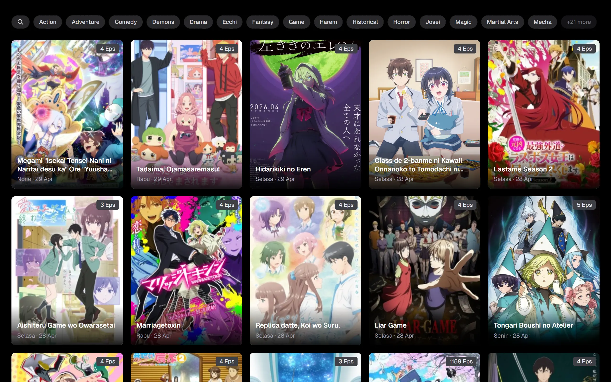
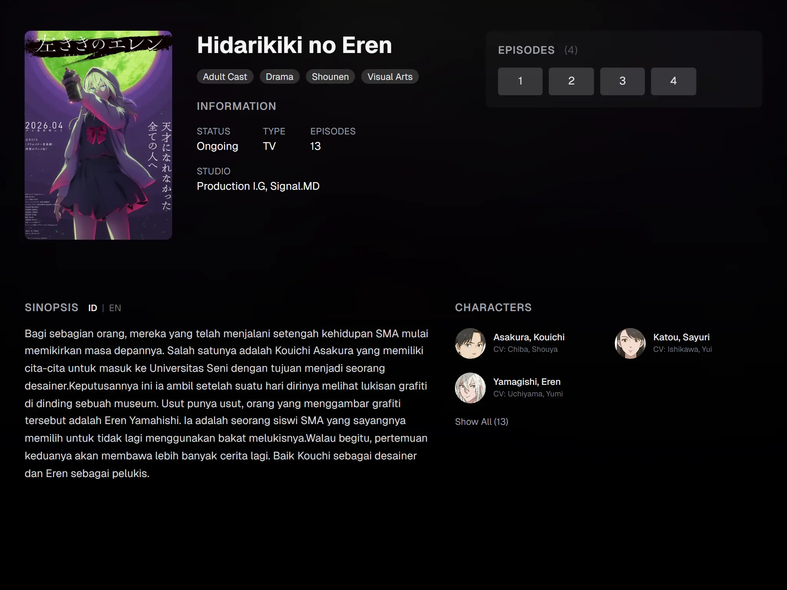
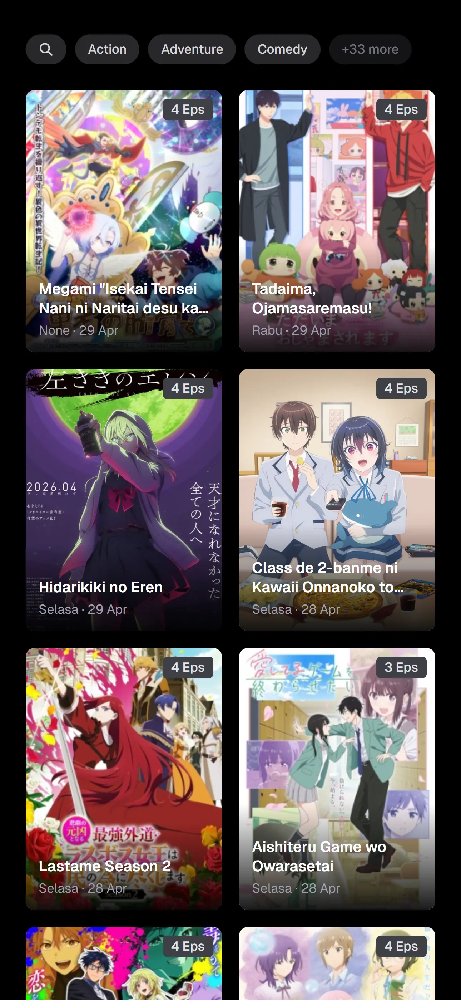

# Nimeplay

Minimal anime streaming app built with Nuxt 4, Vue 3, Tailwind CSS, tRPC, and Capacitor Android. It includes search, genre browsing, anime detail pages, episode navigation, and a custom player.

<p align="center">&nbsp;&nbsp;&nbsp;&nbsp;&nbsp;&nbsp;</p>

## Setup

Requires Node.js 20+ and npm 11+.

```bash
npm install
```

Run locally:

```bash
npm run dev
```

Open `http://localhost:3000` in your browser.

Production build and preview:

```bash
npm run build
npm run preview
```

Static build:

```bash
npm run generate
```

## Development

The main app lives in `app/`, server APIs and tRPC live in `server/`, static files live in `public/`, and the Capacitor project lives in `android/`.

```bash
npm run typecheck
```

## Android

Requires Android Studio and JDK.

```bash
npm run android:sync
npm run android:debug
npm run android:open
```
